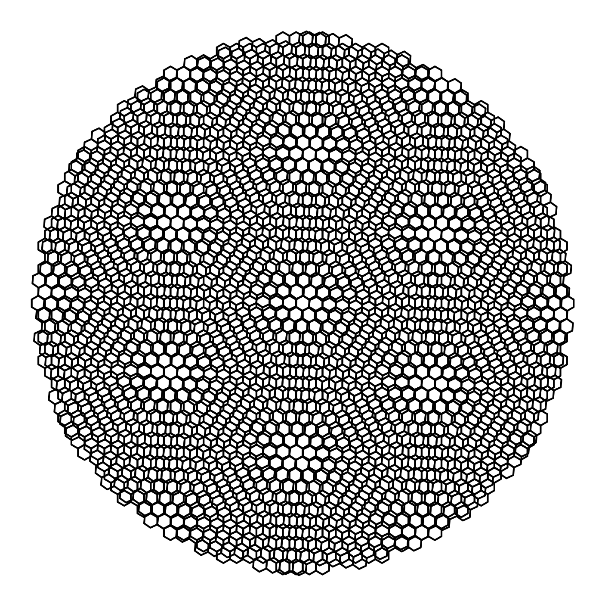

**About**
==================

.. automodule:: About
    :members:
    :noindex:

.. _features:

Features
--------

Main functions include:

* External perturbation
    * electric field
    * magnetic field
    * strain
    * impurity / doping
* Band Structure
    * 1D Band structure along High-Symmetry Points
    * 2D Band structure contour
    * 3D Band structure 
* Density of States (DOS)
    * Total density of state
    * Local density of state (LDOS)
        * Histogram Method
        * Green's Function Method
        * Lorentzian Broadening Method
* Spectral Function
    * Total Spectral function
    * Local Spectral function
        * Green's Function Method
        * Lorentzian Broadening Method
* Fermi Surface / Fermi Contour
    * 2D Fermi surface
* Conductivity
    * dynamical Conductivity
    * DC Conductivity
* Topological Properties
    * Berry Curvature
    * Chern Number
    * Hall Conductivity
* Structure generation (POSCAR format)
    * Output the structure file ``POSCAR`` of the first principle calculation software ``VASP``

