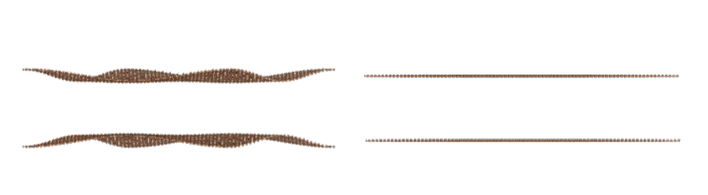

**Advanced**
==================

.. automodule:: Advanced
    :members:
    :noindex:

Corrugation
------------------

When the TBG rotation angle is less than 2 degrees, 
the influence of lattice relaxation will become more and more significant, 
especially out of plane deformation, which can also be called corrugation. 
According to `Phys. Rev. X 8, 031087 <https://journals.aps.org/prx/abstract/10.1103/PhysRevX.8.031087>`_

.. math::

    d(\boldsymbol{\delta})=d_0+2d_1\sum_{j=1}^{3}\cos{(\boldsymbol{a_i^*}\cdot\boldsymbol{\delta})}

where

.. math::

    d_0=\frac{1}{3}(d_{AA}+2d_{AB}) \\
    d_1=\frac{1}{9}(d_{AA}-d_{AB}) \\

and

.. math::

    \boldsymbol{a}_1^*=(2\pi/a)(1, -1/\sqrt{3}) \\
    \boldsymbol{a}_2^*=(2\pi/a)(0, 2/\sqrt{3})

in which
:math:`d_{AA}=3.6 \mathring {\mathrm A}`, :math:`d_{AB}=3.35 \mathring {\mathrm A}`, and 
:math:`a=1.42 \mathring {\mathrm A}` is the bond length of graphene.

The code is as follows:

.. code-block:: python

    def corrugation(points, b_vector):
        
        def find_nearest_reference_vector(points, reference_points):
            distances = np.linalg.norm(points[:, np.newaxis, :] 
                                        - reference_points, axis=2)  
            min_indices = np.argmin(distances, axis=1)  
            nearest_vec = points - reference_points[min_indices]  
            return nearest_vec

        def compute_dot_products(b_vector):
            theta = 120 * np.pi / 180  # 120 degree to radian
            def get_rotation_matrix(theta):
                rotation_matrix = np.array([[np.cos(theta), -np.sin(theta)],
                                            [np.sin(theta),  np.cos(theta)]])
                return rotation_matrix

            G1 = b_vector[0]
            rotation_matrix = get_rotation_matrix(theta)
            G2 = np.dot(rotation_matrix, G1)
            G3 = np.dot(rotation_matrix, G2)
            return G1, G2, G3
        
        target_aa = np.array([0, 0])
        daa = 3.60
        dab = 3.35
        d0 = 1/3*(daa + 2*dab)
        d1 = 1/9*(daa - dab)
        
        G1, G2, G3 = compute_dot_products(b_vector)
        reference_points = np.array([target_aa,
                                    target_aa+cell_info[1],
                                    target_aa+cell_info[2],
                                    target_aa+cell_info[1]+cell_info[2]])
        
        distances_vec = find_nearest_reference_vector(points, reference_points)
        d_corrug = d0 + 2*d1*(np.cos(np.dot(distances_vec, G1)) 
                            + np.cos(np.dot(distances_vec, G2))
                            + np.cos(np.dot(distances_vec, G3))) 
        return d_corrug

    plt.figure()
    top_layer = np.vstack((can[3][:,0:2], can[4][:,0:2]))
    a_vector = np.array([cell_info[1], cell_info[2]]).T
    b_vector = 2*np.pi*np.linalg.inv(a_vector)
    d_corrugation = corrugation(top_layer, b_vector)

    # POSCAR with corrugation correction
    l1a[:,2] = 10 - d_corrugation[:l2a[:,2].shape[0]]/2
    l1b[:,2] = 10 - d_corrugation[l2a[:,2].shape[0]:]/2
    l2a[:,2] = 10 + d_corrugation[:l2a[:,2].shape[0]]/2
    l2b[:,2] = 10 + d_corrugation[l2a[:,2].shape[0]:]/2
    poscar_generator = POSCARGenerator(atomO, atomA, atomB, atomC, can, 
                                        name='TBG', twist_angle=angle_dgr, 
                                        stack_conf='AA', z_height=9)
    poscar_generator.generate_POSCAR(atom_type=['C'])

When we output the structure that takes corrugation into account, 
we will see the left figure below (We have enlarged the amplitude of corrugation to better observe its effects.), 
and the structure that does not consider this effect will be the right figure below.

Electric field
------------------

The effect of the electric field is reflected in the onsite term. 
We can first establish the original hamiltonian, 
and then use the ``onsite_e_field`` method. 
The first parameter is the number of atoms in the sublattice in one layer. 
The second parameter represents that there are two sublattice in one layer, 
because the potential in the same layer is the same, 
the third parameter represents the value of the onsite energy in each layer. 
From the example below, one can see that the onsite energy in the bottom layer is 0, 
and the onsite energy in the upper layer is :math:`0.01 eV/\mathring {\mathrm A}`.

.. code-block:: python

    tb_model_instance = TBModel(atomO, atomB, atomA, atomC, kx=kx, ky=ky, sp_zm=0, b_mag=0, beta_d=0, strain_m=1)
    # basic hamiltonian matrix
    hamiltonian, hopping_data = tb_model_instance.finalize_ham(hopping_list=True) 

    # onsite 
    onsite_part = tb_model_instance.onsite_e_field(len(can[1]), 2, [0, 0.01])  
    hamiltonian += onsite_part

Twisted double bilayer graphene
--------------------------------

To create twisted double bilayer graphene (TDBG) in TBMoST, 
users only need to add two additional layers of atomic information to create the structure:

.. code-block:: python

    n = 6
    m = 7
    nm = (m**2+n**2+4*m*n)/(2*(m**2+n**2+m*n))
    t1 = np.arccos(nm)                   #twisted angle (arc)
    angle_dgr = round((t1/np.pi)*180,2)  #twisted angle (degree)
    print('twisted angle: %s°'%(angle_dgr))
    stack_conf = 'ABAB'  # stacking configuration
    material_name = 'TDBG'

    c = 3**(1/2)
    d = 1.42   #A
    ny = 60    #number of vector for y direction
    nx = ny*2  #number of vector for x direction

    # Define the size and range of the lattice
    lattice_a1 = np.array([c*d,0]) #translational vector in x direction for 4-atom basis
    lattice_a2 = np.array([0,3*d]) #translational vector in y direction for 4-atom basis
    x_range = np.arange(-nx, nx) * lattice_a1[0]
    y_range = np.arange(-ny, ny) * lattice_a2[1]

    tw = TwistedLayer(d)
    # layer 1 and 2
    tbg1a = tw.add_layer('Base', rotation_angle=t1, select_sublattice='A')
    tbg1b = tw.add_layer('Base', rotation_angle=t1, select_sublattice='B')
    tbg2a = tw.add_layer('AB', rotation_angle=t1, select_sublattice='A')
    tbg2b = tw.add_layer('AB', rotation_angle=t1, select_sublattice='B')

    # layer 3 and 4
    tbg3a = tw.add_layer('AA', rotation_angle=-t1, select_sublattice='A')
    tbg3b = tw.add_layer('AA', rotation_angle=-t1, select_sublattice='B')
    tbg4a = tw.add_layer('AB', rotation_angle=-t1, select_sublattice='A')
    tbg4b = tw.add_layer('AB', rotation_angle=-t1, select_sublattice='B')

    # Find the coincident atoms
    rot_layer1 = np.concatenate((tbg1a, tbg1b))
    rot_layer2 = np.concatenate((tbg3a, tbg3b))
    coincident_12 = tw.find_coincident_atoms(rot_layer1, rot_layer2)

    # SupercellFinder
    finder = SupercellFinder(coincident_12)
    finder.find_vertices()
    atomO, atomA, atomB, atomC = finder.get_vertices()
    plotter.plot_unitcell(atomO, atomB, atomA, atomC, lw=2)

    # class instantiation
    count_atm = AtomCounter(atomO, atomB, atomA, atomC)

    # layer 1 and 2
    l1a = count_atm.count_atom_num(tbg1a, stack_conf='AA', sublattice_type='A', h=10)
    l1b = count_atm.count_atom_num(tbg1b, stack_conf='AA', sublattice_type='B', h=10)
    l2a = count_atm.count_atom_num(tbg2a, stack_conf='AB', sublattice_type='A', h=13.35)
    l2b = count_atm.count_atom_num(tbg2b, stack_conf='AB', sublattice_type='B', h=13.35)

    # layer 3 and 4
    l3a = count_atm.count_atom_num(tbg3a, stack_conf='AA', sublattice_type='A', h=16.70)
    l3b = count_atm.count_atom_num(tbg3b, stack_conf='AA', sublattice_type='B', h=16.70)
    l4a = count_atm.count_atom_num(tbg4a, stack_conf='AB', sublattice_type='A', h=20.05)
    l4b = count_atm.count_atom_num(tbg4b, stack_conf='AB', sublattice_type='B', h=20.05)

    can = count_atm.get_can(l1a,l1b,l2a,l2b,l3a,l3b,l4a,l4b)
    cell_info = count_atm.cell_info()

    poscar_generator = POSCARGenerator(atomO, atomA, atomB, atomC, can,
                                    name=material_name, twist_angle=angle_dgr,
                                    stack_conf=stack_conf, z_height=5)

    # output the structure
    poscar_generator.generate_POSCAR(atom_type=['C'])

Twisted double trilayer graphene
--------------------------------

Only the code that is different from TDBG is listed here:

.. code-block:: python

    tw = TwistedLayer(d)
    # layer 1, 2 and 3
    tbg1a = tw.add_layer('Base', rotation_angle=t1, select_sublattice='A')
    tbg1b = tw.add_layer('Base', rotation_angle=t1, select_sublattice='B')
    tbg2a = tw.add_layer('AB', rotation_angle=t1, select_sublattice='A')
    tbg2b = tw.add_layer('AB', rotation_angle=t1, select_sublattice='B')
    tbg3a = tw.add_layer('ABC', rotation_angle=t1, select_sublattice='A')
    tbg3b = tw.add_layer('ABC', rotation_angle=t1, select_sublattice='B')

    # layer 4, 5 and 6
    tbg4a = tw.add_layer('AA', rotation_angle=-t1, select_sublattice='A')
    tbg4b = tw.add_layer('AA', rotation_angle=-t1, select_sublattice='B')
    tbg4a = tw.add_layer('AB', rotation_angle=-t1, select_sublattice='A')
    tbg4b = tw.add_layer('AB', rotation_angle=-t1, select_sublattice='B')
    tbg4a = tw.add_layer('ABC', rotation_angle=-t1, select_sublattice='A')
    tbg4b = tw.add_layer('ABC', rotation_angle=-t1, select_sublattice='B')

    # Find the coincident atoms
    rot_layer1 = np.concatenate((tbg1a, tbg1b))
    rot_layer2 = np.concatenate((tbg4a, tbg4b))
    coincident_12 = tw.find_coincident_atoms(rot_layer1, rot_layer2)

    # class instantiation
    count_atm = AtomCounter(atomO, atomB, atomA, atomC)

    # layer 1, 2 and 3
    l1a = count_atm.count_atom_num(tbg1a, stack_conf='AA', sublattice_type='A', h=10)
    l1b = count_atm.count_atom_num(tbg1b, stack_conf='AA', sublattice_type='B', h=10)
    l2a = count_atm.count_atom_num(tbg2a, stack_conf='AB', sublattice_type='A', h=13.35)
    l2b = count_atm.count_atom_num(tbg2b, stack_conf='AB', sublattice_type='B', h=13.35)
    l3a = count_atm.count_atom_num(tbg3a, stack_conf='ABC', sublattice_type='A', h=16.70)
    l3b = count_atm.count_atom_num(tbg3b, stack_conf='ABC', sublattice_type='B', h=16.70)

    # layer 4, 5 and 6
    l4a = count_atm.count_atom_num(tbg4a, stack_conf='AA', sublattice_type='A', h=20.05)
    l4b = count_atm.count_atom_num(tbg4b, stack_conf='AA', sublattice_type='B', h=20.05)
    l5a = count_atm.count_atom_num(tbg4a, stack_conf='AB', sublattice_type='A', h=23.40)
    l5b = count_atm.count_atom_num(tbg4b, stack_conf='AB', sublattice_type='B', h=23.40)
    l6a = count_atm.count_atom_num(tbg4a, stack_conf='ABC', sublattice_type='A', h=26.75)
    l6b = count_atm.count_atom_num(tbg4b, stack_conf='ABC', sublattice_type='B', h=26.75)

