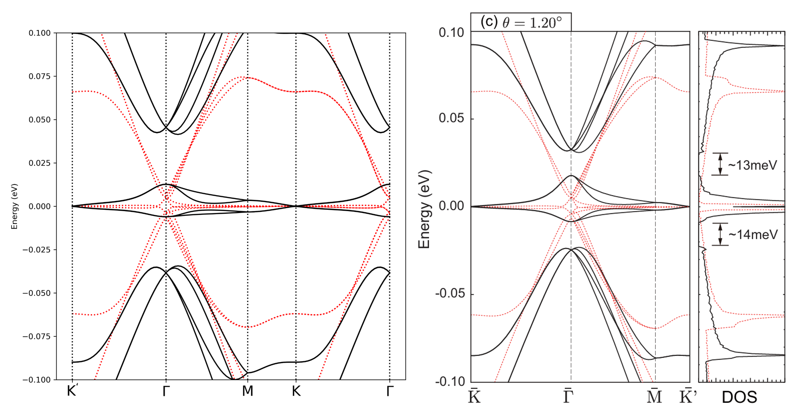
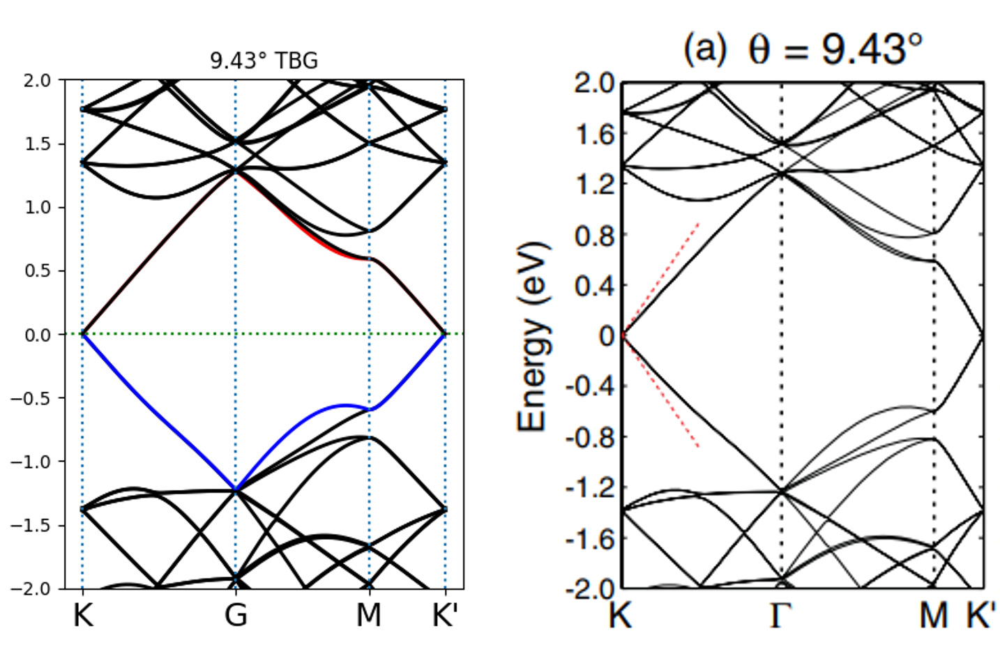
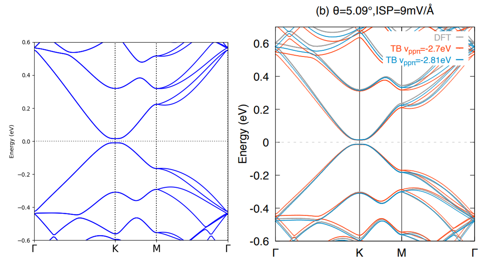
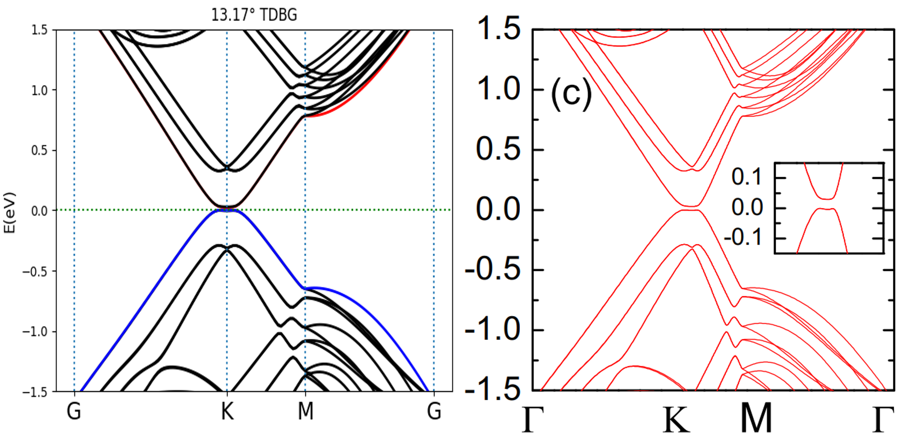
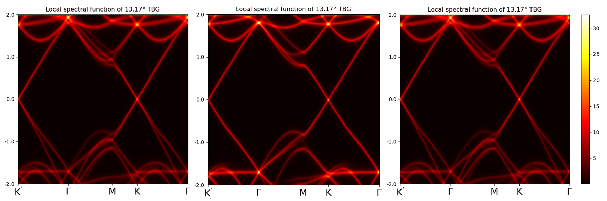
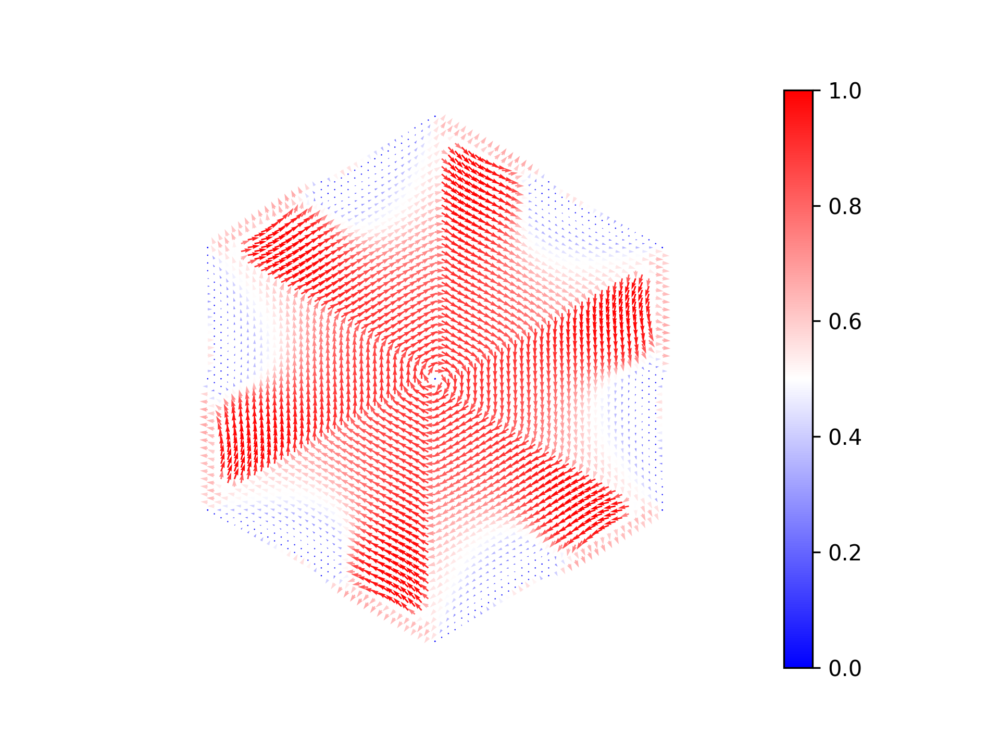

**Gallery**
==================

.. automodule:: Gallery
    :members:
    :noindex:

Corrugation effect and band structure
---------------------------------------

The black solid lines in both images represent the results considering lattice relaxation, 
while the red dashed lines correspond to the band structure of rigid TBG. 
The left panel shows the results calculated using TBMoST, 
which only account for the corrugation correction. 
The right panel presents results from the reference `Phys. Rev. B 96, 075311 <https://journals.aps.org/prb/abstract/10.1103/PhysRevB.96.075311>`_,
where both out-of-plane and in-plane deformation corrections are considered.

Twisted bilayer graphene
---------------------------

The left figure is the band structure calculated using TBMoST, 
and the right figure is the result from `Phys. Rev. B 85, 195458 <https://journals.aps.org/prb/abstract/10.1103/PhysRevB.85.195458>`_. 

Twisted double bilayer graphene
---------------------------------

The left figure is the band structure calculated using TBMoST, 
and the right figure is the result from `Nano letters 20.4 (2020): 2410-2415 <https://pubs.acs.org/doi/10.1021/acs.nanolett.9b05117>`_. 
The polarization between layers is considered in the calculation, so a tiny bandgap appears.

Twisted double trilayer graphene
-----------------------------------

The left figure is the band structure calculated using TBMoST, 
and the right figure is the result from `Phys. Rev. B 111, 075111 <https://journals.aps.org/prb/abstract/10.1103/PhysRevB.111.075111>`_. 
The polarization between layers is considered in the calculation, so a tiny bandgap appears.

Layer projected spectral function
-----------------------------------------

Layer projected spectral function of twisted trilayer graphene ABA stacking, From left to right are bottom layer, middle layer and top layer.

Spin polarized band structure
--------------------------------

.. image:: images/TBG_2179_LSF_spin.png
   :width: 600px
   :align: center

Spin polarized band structure of TBG at :math:`21.79^\circ` after considering Rashba SOC and Zeeman term.

Spin texture
-----------------

Spin texture of TBG at :math:`21.79^\circ` after considering Rashba SOC and Zeeman term.
