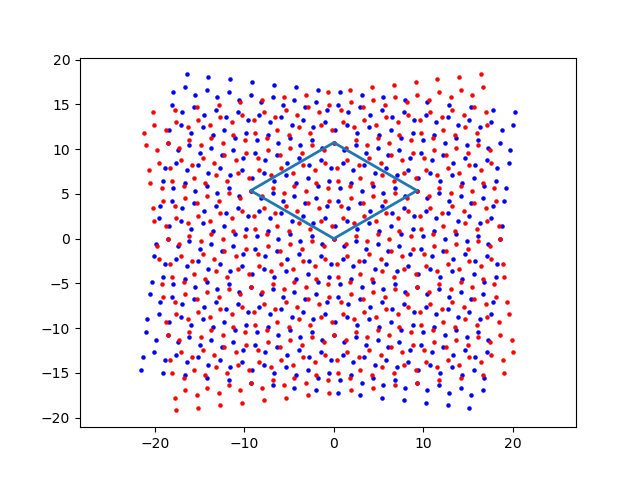
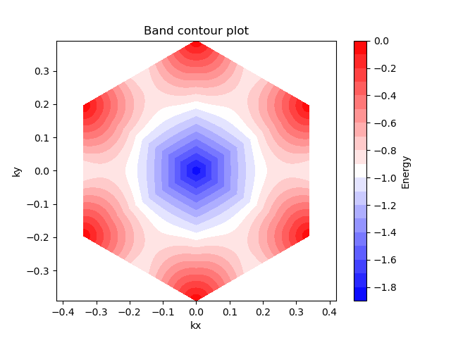
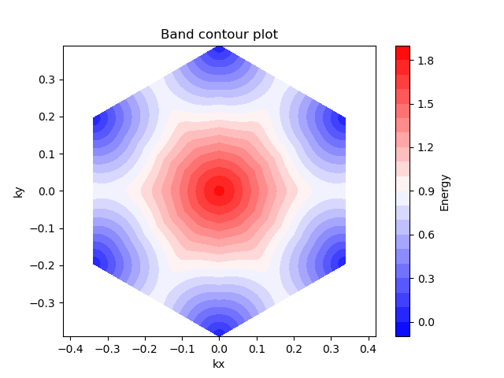
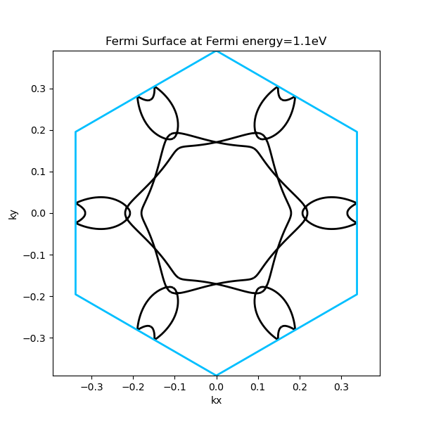
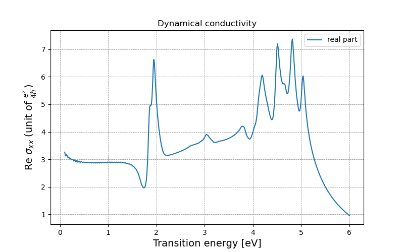
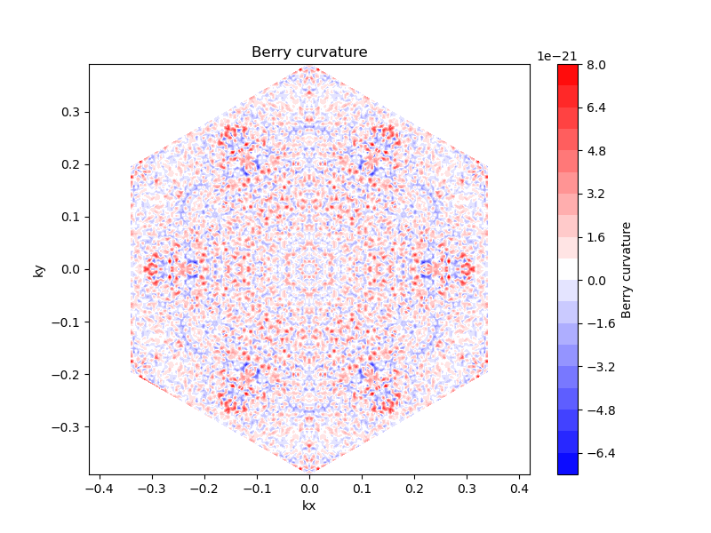

**Tutorials**
==================

.. automodule:: Tutorials
    :members:
    :noindex:

Import packages
------------------

First, we import the basic packages:

.. code-block:: python

   import numpy as np
   import matplotlib.pyplot as plt
   import tbmost

Structure construction
-------------------------

Next, we will build a Moore superlattice. 
We will take twisted bilayer graphene (TBG) as an example, 
so the lattice-related parameters used will be based on graphene, 
that is, the default values.

To rotate a bilayer graphene system to form a periodic structure, 
the rotation angle between the two layers must satisfy the following formula, 
where :math:`m` and :math:`n` are mutually prime positive integers.

.. math::

   \cos{\theta}=\frac{m^2+n^2+4mn}{2(m^2+n^2+mn)}

.. code-block:: python

   from tbmost.core.structure import *
   from tbmost import StructurePlotter

   n = 3 
   m = 2 
   nm = (m**2+n**2+4*m*n)/(2*(m**2+n**2+m*n))
   t1 = np.arccos(nm)                   #twisted angle (arc)
   angle_dgr = round((t1/np.pi)*180,2)  #twisted angle (degree)
   print(f'twisted angle: {angle_dgr} deg')

   c = 3**(1/2)
   d = 1.42   #Angstrom
   ny = 4     #number of vector for y direction
   nx = ny*2  #number of vector for x direction

   # Define the size and range of the lattice
   lattice_a1 = np.array([c*d,0]) #translational vector in x direction for 4-atom basis
   lattice_a2 = np.array([0,3*d]) #translational vector in y direction for 4-atom basis
   x_range = np.arange(-nx, nx) * lattice_a1[0]
   y_range = np.arange(-ny, ny) * lattice_a2[1]

   tw = TwistedLayer(d, x_range, y_range)
   tbg1a = tw.add_layer('Base', rotation_angle=t1, select_sublattice='A')
   tbg1b = tw.add_layer('Base', rotation_angle=t1, select_sublattice='B')
   tbg2a = tw.add_layer('AA', rotation_angle=-t1, select_sublattice='A')
   tbg2b = tw.add_layer('AA', rotation_angle=-t1, select_sublattice='B')

In this way, we have completed the construction of graphene with relative rotation angles between two layers. 
Then we need to find the smallest unit of this periodic repeating structure, which is the unit cell.

.. code-block:: python

   # Find the coincident atoms
   rot_layer1 = np.concatenate((tbg1a, tbg1b))
   rot_layer2 = np.concatenate((tbg2a, tbg2b))

   coincident_12 = tw.find_coincident_atoms(rot_layer1, rot_layer2)

   # Create a plotter instance
   plotter = StructurePlotter()

   # Add different sublattices of different layers
   plotter.add_layer(tbg1a, 'Layer 1 A', 'b')
   plotter.add_layer(tbg1b, 'Layer 1 B', 'b')
   plotter.add_layer(tbg2a, 'Layer 2 A', 'r')
   plotter.add_layer(tbg2b, 'Layer 2 B', 'r')

   # coincident_12 are the overlap atom's coordinates
   finder = SupercellFinder(coincident_12)
   finder.find_vertices()
   atomO, atomA, atomB, atomC = finder.get_vertices()

Once the unitcell is found, we can draw it and view its geometry.

.. code-block:: python

   # Plot structure
   plotter.plot_unitcell(atomO, atomB, atomA, atomC, lw=2)
   plotter.plot(coincident_12,plot_coincident=False)

   l1a = Count_atom_num(tbg1a,atomO, atomB, atomA, atomC).count_atom_num(stack_conf='AA', sublattice_type='A', h=10)
   l1b = Count_atom_num(tbg1b,atomO, atomB, atomA, atomC).count_atom_num(stack_conf='AA', sublattice_type='B', h=10)
   l2a = Count_atom_num(tbg2a,atomO, atomB, atomA, atomC).count_atom_num(stack_conf='AA', sublattice_type='A', h=13.35)
   l2b = Count_atom_num(tbg2b,atomO, atomB, atomA, atomC).count_atom_num(stack_conf='AA', sublattice_type='B', h=13.35)
   can = [len(l1a)+len(l1b)+len(l2a)+len(l2b),l1a,l1b,l2a,l2b]

.. code-block:: python

   Output:
   twisted angle: 13.17 deg
   vertex = [0. 0.]
   supercell is 'horizontal diamond' 

It can be seen that this is a :math:`13.17^\circ` TBG structure, 
and the area framed by the blue line is exactly its unit cell. 
If we want to know other relevant information about the lattice, we can use the following method to view:

.. code-block:: python

   cell_info = Count_atom_num(tbg1a,atomO, atomB, atomA, atomC).cell_info()
   print(cell_info)

.. code-block:: python

   Output:
   (99.5364565788833,
   array([ 0.       , 10.7207649]),
   array([-9.28445475,  5.36038245]),
   10.720764898084)

The first element in the tuple is the area of ​​the unit cell (:math:`\mathring {\mathrm A}^2`), 
the second and third elements are the lattice vectors, and the fourth element is the lattice constant.

Output structure
----------------------

We can save the structure generated above and provide it to other software for calculation and analysis. 
The format we output is based on the format of the structure file ``POSCAR`` of the first principle calculation software :program:`VASP`.

.. code-block:: python

   from tbmost import POSCARGenerator

   poscar_generator = POSCARGenerator(atomO, atomA, atomB, atomC, can, 
                                    name='TBG', twist_angle=angle_dgr, 
                                    stack_conf='AA')
   poscar_generator.generate_POSCAR(atom_type=['C'])

The following message will appear after successful output:

.. code-block:: python

   =====================================================
   POSCAR file generated at: POSCAR_TBG_1317_AA
   POSCAR was written successfully.
   =====================================================
   Time taken: 0.000000 seconds

Constructing the Hamiltonian
------------------------------

In order to calculate the band structure, density of states, 
and other physical properties, we first need to construct the Hamiltonian of the system. 
We will input the four vertices of the lattice we obtained earlier into the ``TBModel`` class, 
and also input the test k-points. For this demonstration, 
we use the :math:`\Gamma` point as the test k-point because the Hamiltonian depends on :math:`k`, 
but for simplicity, we will not use a more complex choice here.

.. code-block:: python

   from tbmost.analysis.solver import *
   from tbmost import TBModel

   kx = np.array([0])
   ky = np.array([0])
   tb_model_instance = TBModel(atomO, atomB, atomA, atomC, kx=kx, ky=ky, can=can, sp_zm=0, b_mag=0, beta_d=0, strain_m=1)
   hamiltonian, hopping_data = tb_model_instance.finalize_ham(hopping_list=True)  # basic Hamiltonian
   onsite_part = tb_model_instance.onsite_e_field(len(can[1]), 2, [0,0])  # onsite energy, for A,B sublattice are 0 here
   hamiltonian += onsite_part
   solver = EigenSolver(hamiltonian)

In this way, the Hamiltonian is constructed. 
We use these two variables ``hamiltonian``, ``hopping_data`` to store the constructed Hamiltonian. 
The first variable stores the Hamiltonian matrix after the k point is introduced, 
and the second variable stores hopping related information.

We can solve the matrix diagonalization using the ``solve_eig method`` in the ``EigenSolver`` class, 
and we can choose whether we want to return eigenvalues, eigenvectors, or both.

.. code-block:: python

   # only return eigenvectors
   tb_eigenvectors = solver.solve_eig(return_vectors=True)

   # only return eigenvalues
   tb_eigenvalues = solver.solve_eig(return_eigenvalues=True)

   # return both
   tb_eigenvalues, tb_eigenvectors = solver.solve_eig()

.. code-block:: python

   flattened = [item for sublist in hopping_data for item in sublist]
   hopping_array = np.array(flattened)
   np.save(f'TBG_{int(angle_dgr * 100)}_hopping.npy', hopping_array)

.. note::

   This is a crucial step. To avoid repeatedly generating the Hamiltonian matrix, 
   we can save the ``hopping_data`` we just computed. Later, 
   when calculating physical quantities that require the Hamiltonian, 
   we can directly read the contents of the file and quickly generate the Hamiltonian.

Mesh grid in k space 
-------------------------

Because we are calculating a periodic structure, 
the Hamiltonian and the physical quantities calculated later depend on the grid points in k-space. 
We can use the method in ``Moire_Brillouin_zone`` class to help us generate k-points.

.. code-block:: python

   from tbmost import Moire_Brillouin_zone

   mbz = Moire_Brillouin_zone(atomO, atomB, atomA, atomC)

   # For testing: Draw and calculate the rhombus/hexagonal BZ and the k points inside it
   mbz.hexagon_bz(kpoints=11, plot_bz=True, plot_redbz_6=True)
   kxx, kyy, a1_norm, a2_norm = mbz.hexagon_bz(plot_bz=False)

The following is the message displayed after the k-points are generated. 
``TBMoST`` will output the real space vectors and reciprocal space vectors of the lattice 
as well as the coordinates of the high symmetry points :math:`K(K')` and :math:`M`. 
In addition, the number of all lattice points in the first Brillouin zone will also be displayed at the bottom.

.. code-block:: python

   Output:
   Real-space lattice vector:
   9.284455   5.360382
   -9.284455   5.360382

   Reciprocal lattice vector:
   0.338371   0.586076
   -0.338371   0.586076

   k_valleys:
      0.0000     0.3907
      -0.3384     0.1954
      -0.3384    -0.1954
      -0.0000    -0.3907
      0.3384    -0.1954
      0.3384     0.1954

   m_points:
      0.1692     0.2930
      -0.1692     0.2930
      -0.3384    -0.0000
      -0.1692    -0.2930
      0.1692    -0.2930
      0.3384     0.0000
   number of k-point in 1/6 reduced BZ: 22
   Input kpoints is 11
   Predicted number of K points: 97 
      Actual number of K points: 97

Band structure
------------------

1D Band structure along high symmetry point
^^^^^^^^^^^^^^^^^^^^^^^^^^^^^^^^^^^^^^^^^^^^^^

To compute the one-dimensional band structure, 
we use the ``k_path_bnd`` method in the ``BandStructure`` class, 
and we use the default path, namely :math:`K'-\Gamma-M-K-\Gamma`.

.. code-block:: python

   from tbmost import BandStructure

   kdens = 200 
   k_num_near_hsp = 30  # number of k points near specific high symmetry point 
   bnd_str = BandStructure(angle=angle_dgr, name='TBG', can=can, plotb=True)
   AllK, k_path, Kpaths_coord = bnd_str.k_path_bnd(atomO, atomB, atomA, atomC, k_sec_num=4, kdens=kdens)

   tb_model_instance = TBModel(atomO, atomB, atomA, atomC, kx=k_path[:,0], ky=k_path[:,1], 
                               can=can, sp_zm=0, b_mag=0, beta_d=0, strain_m=1)
   hamiltonian = tb_model_instance.finalize_ham()  # Basic Hamiltonian matrix
   solver = EigenSolver(hamiltonian)
   eigenvalues, eigenvectors = solver.solve_eig()  # return both eigenvalues and eigenvectors

   bnd_str.plot_tb_band(eigenvalues, AllK, Kpaths_coord, kdens=kdens, mode=1)

.. image:: images/TBG_1317_bnd.png
   :width: 500px
   :align: center
   
The intersection of K' and K is the Dirac point. The blue and red lines represent the highest valance band and the lowest conduction band.

2D Band structure
^^^^^^^^^^^^^^^^^^^^

To calculate the two-dimensional band structure we need to generate k points uniformly in the Brillouin zone, 
so we need to use the ``Moire_Brillouin_zone`` class introduced earlier.

.. code-block:: python

   # plot 2D contour band 
   kxx0, kyy0, a1_norm, a2_norm = mbz.hexagon_bz(kpoints=159, plot_bz=False,
                                                bz_type='redbz12',
                                                plot_redbz_12=False)

   tb_model_instance = TBModel(atomO, atomB, atomA, atomC, kx=kxx0, ky=kyy0, 
                              can=can, sp_zm=0, b_mag=0, beta_d=0, strain_m=1)
   hamiltonian = tb_model_instance.finalize_ham()  # Basic Hamiltonian matrix
   solver = EigenSolver(hamiltonian)
   eigenvalues, eigenvectors = solver.solve_eig()  # return both eigenvalues and eigenvectors

After generating the k points, 
we draw the two-dimensional structure diagrams of the lowest conduction band and the highest valance band respectively.

.. code-block:: python

   twod_bnd = bnd_str.plot_2b_contour_band(eigenvalues, kxx0, kyy0, 
                                        bnd_index=37, save_npyz=False,
                                        contour_line=0,plt_bnd=False)

   mbz.magic_mirror(twod_bnd, contour_value=None)

.. code-block:: python

   twod_bnd = bnd_str.plot_2b_contour_band(eigenvalues, kxx0, kyy0, 
                                        bnd_index=38, save_npyz=False,
                                        contour_line=0,plt_bnd=False)

   mbz.magic_mirror(twod_bnd, contour_value=None)

3D Band structure
^^^^^^^^^^^^^^^^^^^^

The 3D band structure can help us view the band bending from another perspective. 
By using the k-points of calculating the 2D band structure, 
we similarly choose to plot the lowest conduction band and the highest valence band.

.. code-block:: python

   # plot 3d band structure for specific bands
   bnd_str.plot_3b_band(solve_eig=eigenvalues, AllKx=kxx0, AllKy=kyy0, 
                        bnd_indices=[37,38], save_npyz=False)

In addition to using ``matplotlib`` for presenting 3D plots, 
we can utilize ``plotly`` for more detailed observation.

.. code-block:: python

   import plotly.graph_objects as go

   cmap_list = ['Blues', 'Reds']

   # build plotly figure
   fig = go.Figure()
   bnd_index_list = [37,38]

   for i, n in enumerate(bnd_index_list):
      fig.add_trace(go.Surface(
            x=kxx0,
            y=kyy0,
            z=eigenvalues[:,n],
            colorscale=cmap_list[i],
            opacity=1,  
            showscale=False,
            hoverinfo='z'
      ))

   fig.update_layout(
      width=600, height=500,
      scene=dict(
         xaxis_title='kx',
         yaxis_title='ky',
         zaxis_title='E(kx, ky)',
         aspectratio=dict(x=1, y=1, z=1)  # Control xyz axis scale
      ),
      margin=dict(
         l=40,  # left margin
         r=40,  # right margin
         b=40,  # bottom margin
         t=20   # top margin
      ),
      autosize=True  # Automatically resize canvas
   )

   # save as html
   fig.write_html(f'TBG_3d_bnd.html')
   fig.show()

.. raw:: html

   <iframe src="_static/TBG_AA_1317_3dbnd.html" 
           width="800" 
           height="400" 
           frameborder="0">
   </iframe>

.. 
   .. list-table::
      :width: 100%
      :class: borderless

      * - .. image:: images/TBG_1317_3Dbnd.png
             :width: 100%
         
        - .. image:: images/TBG_1317_3Dbnd2.png
             :width: 100%

Fermi Surface
-----------------

.. code-block:: python

   # plot Fermi surface(Fermi contour)
   fermi_surf_data = bnd_str.Fermi_surface(eigenvalues, kxx0, kyy0, 
                                          e_fermi=1.3,
                                          plt_fs=False, n_grid=50)

   mbz.magic_mirror(fermi_surf_data, contour_value=1.3)

   # plot Moire Brillouin zone boundary for Fermi contour
   import contextlib
   import os
   with contextlib.redirect_stdout(open(os.devnull, 'w')):
      mbz2 = Moire_Brillouin_zone(atomO, atomB, atomA, atomC)
      mbz2.hexagon_bz(kpoints=3, plot_bz=False, plot_bzline_only=True)

Fermi surface. The blue line is the boundary of the first Brillouin zone.

Spectral function
--------------------

Spectral functions are often used to describe the electronic structure and excitation properties of a system. 
Specifically, the spectral function is usually a frequency-dependent function of the imaginary part of the Green's function, 
which characterizes the response of the system to external perturbations.

.. math::

   A(k,\omega)=-\frac{1}{\pi}\text{Im}[G(k,\omega)]

.. code-block:: python

   e_grid = 200
   fe_array = np.linspace(-5,5,e_grid)

   bnd_array = np.array([13,14,15,16])
   site_array = np.array([7,8])

   # plot the spectral function contributed only by site 8 and 9
   sf_array1 = bnd_str.spectral_function_Local(energy_array=fe_array, 
                                             solve_eig=eigenvalues, 
                                             solve_vec=eigenvectors,
                                             delta=0.03, site_list=site_array,
                                             bnd_list=None)
   # plot the total spectral function 
   sf_array2 = bnd_str.spectral_function_Delta(energy_array=fe_array, 
                                             solve_eig=eigenvalues,
                                             delta=0.03)

   bnd_str.plot_spectral_function(sf_array1, x_ticks_coord=None,                     
                                 x_new_ticks=None, save_fig=False,
                                 site_list=site_array)

   bnd_str.plot_spectral_function(sf_array2, x_ticks_coord=None,                     
                                 x_new_ticks=None, save_fig=False)

The left figure shows the spectral function calculated by selecting the 8th and 9th atoms; 
the right figure shows the plot of all atoms. The difference in values ​​between the two figures can be seen.

.. list-table::
   :width: 100%
   :class: borderless

   * - .. image:: images/TBG_1317_LSP.png
          :width: 100%
         
     - .. image:: images/TBG_1317_TSP.png
          :width: 100%

Density of state
-------------------

The density of states (DOS) describes the number of quantum states within a given energy range. 
It reflects the electronic structure of a material and is crucial to its conductivity, 
optical properties and other electronic properties. 
Regions with high density of states indicate that electrons have more states to fill near that energy, 
while regions with low density of states indicate that there are fewer or even no electron states. 
The local density of states (LDOS) is the spatial distribution of DOS, 
which represents the density of electronic states at a specific spatial position and helps analyze surface states, 
edge states or local energy level characteristics.

Total density of state
^^^^^^^^^^^^^^^^^^^^^^^^^

Let us first demonstrate the total state density of the system. 
We will use two different calculation methods to obtain the total state density of the system. 
The following is the formula basis of the Lorentzian broadening method:

.. math::

   DOS(\omega)=\frac{1}{\pi}\sum_{k,n}\frac{\frac{\delta}{2}}{(\omega-E_{n}(k))^2+(\frac{\delta}{2})^2}

We need to have the eigenvalues ​​and eigenvectors calculated previously as parameter input, 
as well as the k-point coordinates corresponding to these features.

.. code-block:: python

   from tbmost import DensityOfState
   dos = DensityOfState(solve_eig=eigenvalues, solve_vec=eigenvectors,
                        AllKx=kxx0, AllKy=kyy0, e_range=[-5., 5.])

   # Total DOS
   dos.total_dos_Hist(bins=200, rot_dos=False)
   dos.total_dos_Delta(delta=0.025, rot_dos=False, e_grid=200)
   #dos.total_dos_GF(ham_matrix=hamiltonian, rot_dos=False, e_grid=200)

.. list-table::
   :width: 100%
   :class: borderless

   * - .. image:: images/TBG_1317_dos(hist).png
          :width: 100%
         
     - .. image:: images/TBG_1317_dos(Delta).png
          :width: 100%

The left figure is using histogram method, 
while the right figure using the Lorentzian broadening method.

It can be seen that the state density values ​​and curves obtained by these two methods are very close, 
but there are still slight differences. This depends on the number of histograms used. 
We can adjust the parameter ``bins``. 
In addition, for the total state density obtained using the Lorentzian broadening method, 
the parameter ``delta`` in the ``total_dos_Delta`` method can be used to control the broadening, 
as well as ``e_grid`` to control the number of energy grid points.

Local density of state
^^^^^^^^^^^^^^^^^^^^^^^^^

We can selectively view the contribution of a few atoms to the system's density of states. 
In the following example, we select two sets of atoms, numbered 0, 1, 2, and 25 are first set,
while 7,9,15 and 22 are second set.

.. code-block:: python

   # LDOS
   site_arr = np.array([0,1,2,25])
   dos.ldos(site_list=site_arr, plot_ldos=True, rot_dos=False, e_grid=200)

   site_arr = np.array([7,9,15,22])
   dos.ldos(site_list=site_arr, plot_ldos=True, rot_dos=False, e_grid=200)

It can be seen that when projected onto the contributions of different atoms, 
their values ​​are slightly different.

.. list-table::
   :width: 100%
   :class: borderless

   * - .. image:: images/TBG_1317_ldos.png
          :width: 100%
         
     - .. image:: images/TBG_1317_ldos2.png
          :width: 100%

.. note::

   The parameter `site_list` needs to input data in the form of an array.
   There is no limit to the number of elements as long as the atom number does not exceed the matrix dimension. 
   Here, we choose to view four atoms. Another input parameter is the atom number.
   since Python conventionally starts indexing from 0, 
   while the returned image displays the corresponding atom number, 
   there will be a difference of 1 between the two. 
   If you want to check the atomic indices for projection, you can use the following command:

   .. code-block:: python

      plotter.plot(coincident_12,plot_coincident=True)
      plotter.plot_index_atom(can)

Conductivity
----------------

In ``TBMoST``, dynamic conductivity is calculated based on the **Kubo Formula**, 
which describes the electronic response of a material under an applied electric field 
and is suitable for analyzing frequency-dependent electrical properties.

.. math::

   \sigma_{\alpha\beta}(\omega)=\frac{i\hbar}{V}\sum_{m,n}\frac{f(E_m)-f(E_n)}{E_m-E_n}\frac{\bra{m}j_{\alpha}\ket{n}\bra{n}j_{\beta}\ket{m}}{E_m-E_n+\hbar\omega+i\eta}

where 
:math:`\sigma_{\alpha\beta}(\omega)` is the conductivity tensor component at frequency :math:`\omega`.
:math:`E_m`, :math:`E_n` are the electron energy levels,
:math:`f(E)` is the Fermi-Dirac distribution function,
:math:`j_{\alpha} = -e v_{\alpha}` is the current density operator, :math:`v_{\alpha}` is the velocity operator,
:math:`V` is the volume, :math:`\eta` is a small broadening parameter to ensure numerical stability.

In terms of operation, we also need to input the eigenvalues ​​and eigenvectors 
as well as the k-point coordinates corresponding to these eigenvalues. 
Since the tensor component we chose is ``xx``, that is, the two current density operators are both in the ``x`` direction, 
we need to input ``xx`` in the parameter ``direction``. When using the ``dynamical_conductivity`` method, 
we can choose how to calculate the current density matrix. 
This can be done through the parameter ``method``. ``method=1`` means using finite differences for calculation, 
and ``delta`` needs to be controlled to adjust the accuracy of the differences. 
If ``method=2`` is used, the result of the analytical differential form is used for calculation.

.. code-block:: python

   from tbmost import Optical_conductivity
    
   # dynamical conductivity
   oc = Optical_conductivity(solve_eig=eigenvalues, solve_vec=eigenvectors,
                           ham_matrix=hamiltonian, AllKx=kxx0, AllKy=kyy0,
                           e_range=[0.1,6], direction='xx')

   oc.dynamical_conductivity(method=1, e_grid=500, delta=1e-8, eta=1e-2*3,
                           data=loaded_array, num_k=kxx0.shape[0],
                           volumn_spcell=cell_info[0])

Topological properties
--------------------------

In topological insulators, the Berry curvature causes electrons to generate transverse currents 
in the absence of an external magnetic field, which is the anomalous Hall effect (AHE).

The Chern number is a topological invariant that distinguishes different topological phases.
It can usually be calculated by integrating the Berry curvature in momentum space:

.. math::

   C_n=\frac{1}{2\pi}\int_{BZ}\Omega_{n}d^2k

In some materials (such as Weyl semimetals), the Berry curvature monopole corresponds to Weyl points, 
which are similar to magnetic monopoles in momentum space.

Berry curvature is related to **nonlinear optoelectronic effects** (such as the photoinduced Hall effect). 
In topological materials, nonlinear optical responses can be used to detect Berry curvature.

In **TBMoST**, users can calculate the Berry curvature in the Brillouin zone using the tight binding model. 
We choose to compute the Berry curvature of the highest valance band, which can be controlled by the parameter ``select_bnd_index``.

.. code-block:: python

   from tbmost import Topology

   topo = Topology(solve_eig=eigenvalues, solve_vec=eigenvectors, 
                  AllKx=kxx0, AllKy=kyy0, mode='plane')

   berry_curv, chern_number = topo.berry_curvature_basic(
                                       data=loaded_array, method=1, 
                                       select_bnd_index=37,
                                       plt_bc=True, contour_line=0)

   mbz.magic_mirror(berry_curv, contour_value=None)

Because TBG is not a topological insulator at large twisted angles, 
its Berry curvature is very small and can be ignored.

In topological insulators (such as Chern insulators, quantum Hall effect), 
the Hall conductivity can be determined by the Chern number of the energy band:

.. math::

   \sigma_{\alpha\beta}=\frac{e^2}{h}\sum_nC_n

Among them, is the Chern number of the  :math:`n` th energy band, 
and  :math:`e^2/h` is the minimum value of the quantized conductivity. 
The Chern number can be obtained by integrating Berry curvature in Brillouin zone. In the previous calculation, 
we use the variable ``chern_number`` to obtain the return value of the ``berry_curvature_basic`` method.

.. code-block:: python

   print(chern_number)

   Output:
   -9.615313668486078e-21

Next we calculate the Hall conductivity contributed by the selected band

.. code-block:: python

   from scipy.constants import e, h
   print(e**2/h*chern_number)

   Output:
   -3.725016615742094e-25

From this we can know that large twisted angles TBG are not a topological insulator 
without the influence of external fields or other effects.

