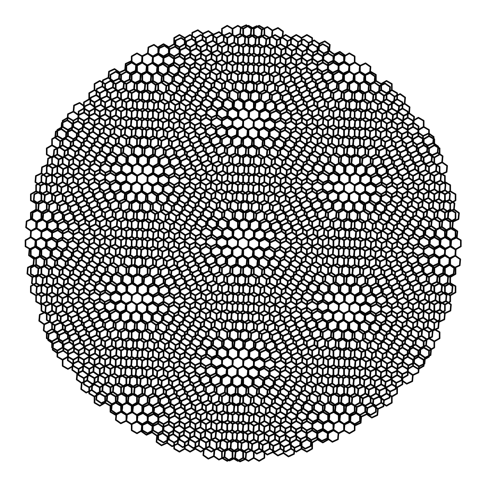
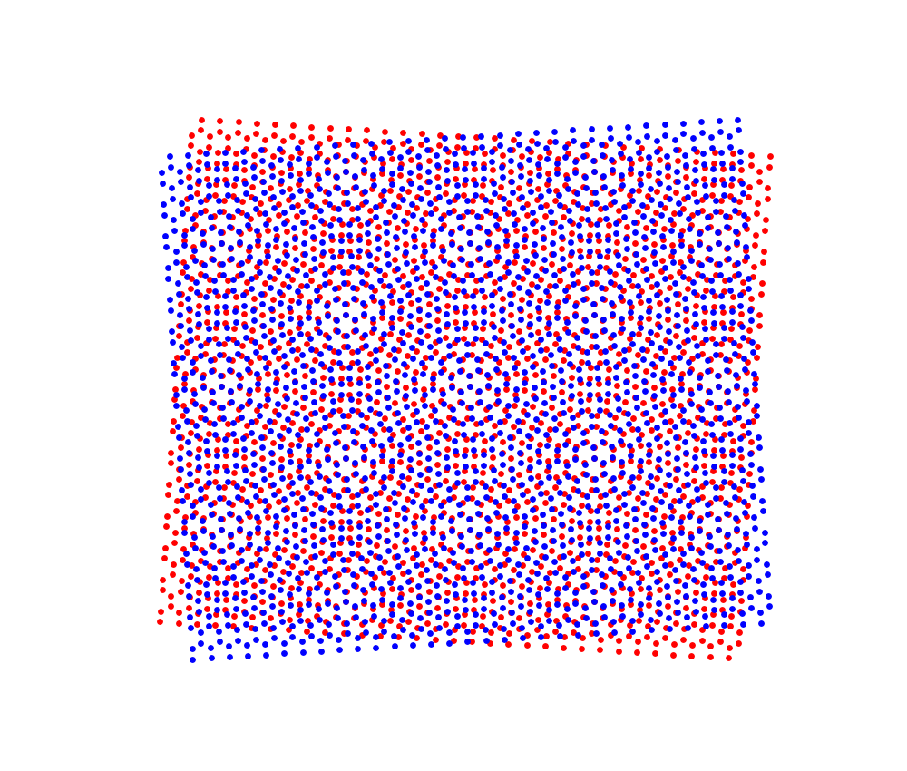
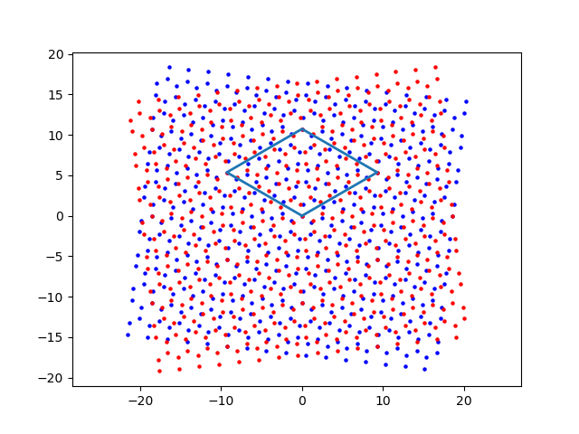
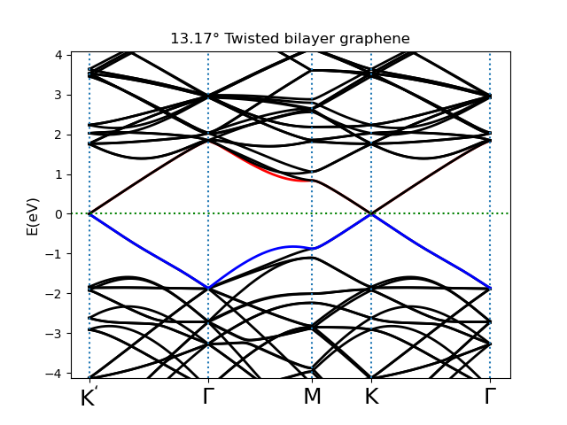
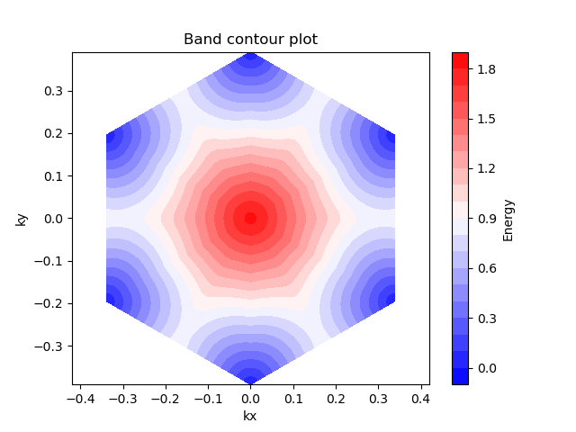
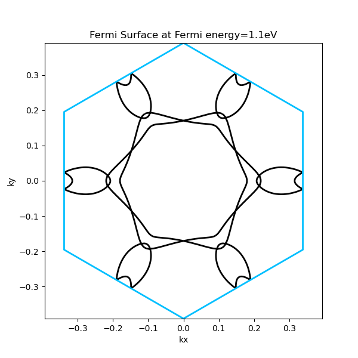
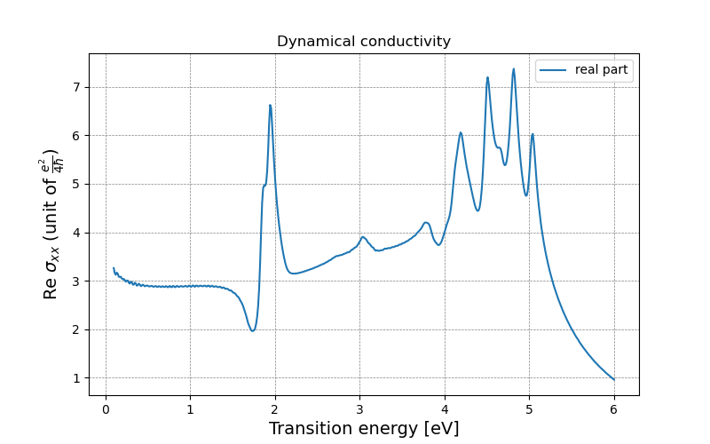
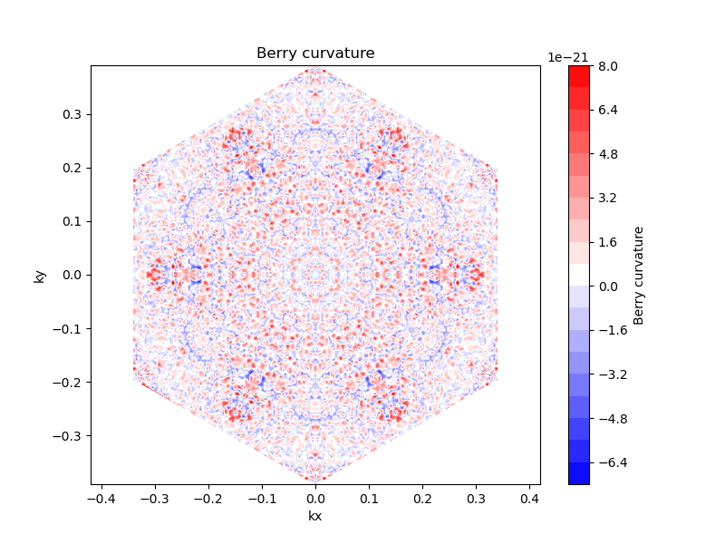

TBMoST：計算 Moiré 超晶格的強大工具 
=================================

TBMoST (Tight Binding for Moiré Super sTructure) 是一款專為 Moiré 超晶格 設計的高效 Python 科學計算套件，基於 Tight Binding Model (TBM) 進行電子結構計算。

該套件專門用於處理 **扭轉層二維材料 (twisted-layer materials)**，可高效計算並分析多種物理性質，包括：

* 電子能帶 (Band Structure)
* 態密度 (Density of States, DOS)
* 譜函數 (Spectral Function)
* 費米面 (Fermi Surface)
* 電導率 (Dynamical Conductivity)
* Berry 曲率 (Berry Curvature) 等

TBMoST 具備 **高度模組化**、**計算效率高** 及 **直觀易用的 API**，適用於從 **理論研究** 到 **數值模擬**，幫助研究人員深入探索 **Moiré 物理** 及 **新穎二維材料電子系統** 的特性。

此外，TBMoST 內建 **可視化工具**，可生成 **能帶結構圖**、**費米面圖**、**態密度圖** 及 **其他材料物理圖像**，讓使用者更直觀地理解計算結果。

無論是 **研究 Moiré 超晶格的新奇量子現象**，還是 **開發與調控二維材料的電子特性**，TBMoST 都能提供強大的支持，使研究變得更高效、更精確！ 🚀

關於TBMoST
----------

主要功能包含:

* 1. 能帶結構 (Band Structure)
   * 高對稱點一維能帶計算 (1D Band Structure along High-Symmetry Points)
   * 二維能帶圖 (2D Band Map)
   * 三維能帶圖 (3D Band Plot)

* 2. 態密度 (Density of States, DOS)
   * 總電子態密度 (Total DOS)
   * 局域態密度 (Local DOS, LDOS)
   * 三種計算方式:
      * 普通直方圖計算 (Histogram Method)
      * 格林函數法 (Green's Function Method)
      * Lorentzian Broadening Method

* 3. 譜函數 (Spectral Function)
   * 總譜函數 (Total Spectral Function)
   * 局域譜函數 (Local Spectral Function, LSF)
   * 兩種計算方式:
      * 格林函數法 (Green's Function Method)
      * Lorentzian Broadening Method

* 4. 費米面 (Fermi Surface / Fermi Contour)
   * 二維費米輪廓

* 5. 電導率 (Optical Conductivity)
   * 頻率相依電導率 (dynamical Conductivity)
   * 靜態電導率 (DC Conductivity)

* 6. 拓撲性質 (Topological Properties)
   * 貝里曲率 (Berry Curvature)
   * 陳數 (Chern Number)
   * 霍爾電導 (Hall Conductivity)

* 7. 結構生成 (POSCAR格式)
   * 輸出第一原理計算軟體`VASP`的結構檔案`POSCAR`

範例圖集
-------

安裝需求
-------

請先安裝以下套件:

.. code-block:: python

    numpy
    matplotlib
    scipy
    numba

教學
----

導入套件
^^^^^^^^
首先，我們先導入基本的套件:

.. code-block:: python

    import numpy as np
    import matplotlib.pyplot as plt
    import tbmost

建立結構
^^^^^^^^

接著我們來建立摩爾超晶格，我們將以旋轉雙層石墨烯為例(twisted bilayer graphene)，因此用到的晶格相關參數都會以石墨烯為準，也就是預設值。

旋轉雙層石墨烯要形成週期結構，期兩層間的旋轉角度要滿足如下公式，其中 $m$、 $n$ 是互質的正整數。

.. math::

    \cos{\theta}=\frac{m^2+n^2+4mn}{2(m^2+n^2+mn)}

.. code-block:: python

    from tbmost.core.structure import *
    from tbmost import StructurePlotter
    
    n = 3 
    m = 2 
    nm = (m**2+n**2+4*m*n)/(2*(m**2+n**2+m*n))
    t1 = np.arccos(nm)                   #twisted angle (arc)
    angle_dgr = round((t1/np.pi)*180,2)  #twisted angle (degree)
    print('twisted angle: %s°'%(angle_dgr))
    
    c = 3**(1/2)
    d = 1.42   #A
    ny = 4     #number of vector for y direction
    nx = ny*2  #number of vector for x direction
    
    # Define the size and range of the lattice
    lattice_a1 = np.array([c*d,0]) #translational vector in x direction for 4-atom basis
    lattice_a2 = np.array([0,3*d]) #translational vector in y direction for 4-atom basis
    x_range = np.arange(-nx, nx) * lattice_a1[0]
    y_range = np.arange(-ny, ny) * lattice_a2[1]
    
    tw = TwistedLayer(d, x_range, y_range)
    tbg1a = tw.add_layer('Base', rotation_angle=t1, select_sublattice='A')
    tbg1b = tw.add_layer('Base', rotation_angle=t1, select_sublattice='B')
    tbg2a = tw.add_layer('AA', rotation_angle=-t1, select_sublattice='A')
    tbg2b = tw.add_layer('AA', rotation_angle=-t1, select_sublattice='B')

這樣我們就把兩層之間有相對轉角的石墨烯給建立完成了，接著我們需要找出這個週期性重複結構的最小單元，也就是unitcell。

.. code-block:: python

    # Find the coincident atoms
    rot_layer1 = np.concatenate((tbg1a, tbg1b))
    rot_layer2 = np.concatenate((tbg2a, tbg2b))
    
    coincident_12 = tw.find_coincident_atoms(rot_layer1, rot_layer2)
    
    # Create a plotter instance
    plotter = StructurePlotter()
    
    # Add different sublattices of different layers
    plotter.add_layer(tbg1a, 'Layer 1 A', 'b')
    plotter.add_layer(tbg1b, 'Layer 1 B', 'b')
    plotter.add_layer(tbg2a, 'Layer 2 A', 'r')
    plotter.add_layer(tbg2b, 'Layer 2 B', 'r')
    
    # coincident_12 are the overlaping atoms
    finder = SupercellFinder(coincident_12)
    finder.find_vertices()
    atomO, atomA, atomB, atomC = finder.get_vertices()

unitcell找到後我們可以將其畫出來並查看其幾何構造

.. code-block:: python

    # Plot structure
    plotter.plot_unitcell(atomO, atomB, atomA, atomC, lw=2)
    plotter.plot(coincident_12,plot_coincident=False)
    
    l1a = Count_atom_num(tbg1a,atomO, atomB, atomA, atomC).count_atom_num(stack_conf='AA', sublattice_type='A', h=10)
    l1b = Count_atom_num(tbg1b,atomO, atomB, atomA, atomC).count_atom_num(stack_conf='AA', sublattice_type='B', h=10)
    l2a = Count_atom_num(tbg2a,atomO, atomB, atomA, atomC).count_atom_num(stack_conf='AA', sublattice_type='A', h=13.35)
    l2b = Count_atom_num(tbg2b,atomO, atomB, atomA, atomC).count_atom_num(stack_conf='AA', sublattice_type='B', h=13.35)
    can = [len(l1a)+len(l1b)+len(l2a)+len(l2b),l1a,l1b,l2a,l2b]

.. code-block:: python

    Output:
    twisted angle: 13.17°
    vertex = [0. 0.]
    supercell is 'horizontal diamond' 

可以看到這是 $13.17\degree$ 的石墨烯結構，而藍色線條框起來的範圍正是其unitcell。如果我們還想知道關於晶格的其他相關資訊可以用以下方法查看:

.. code-block:: python

    cell_info = Count_atom_num(tbg1a,atomO, atomB, atomA, atomC).cell_info()
    print(cell_info)

.. code-block:: python

    Output:
    (99.5364565788833,
     array([ 0.       , 10.7207649]),
     array([-9.28445475,  5.36038245]),
     10.720764898084)

這些資訊告訴我們unitcell的面積大約是 $100\AA^2$，中間兩行分別是兩個晶格向量，最後的 $10.72\AA$ 則是晶格常數。

輸出結構
^^^^^^^^

我們可以將上面產生的結構保存下來，提供給其他軟體進行計算和分析，我們輸出的格式是以第一原理計算軟體 `VASP` 的結構檔案 `POSCAR` 的格式為基準。

.. code-block:: python

    from tbmost import POSCARGenerator
    
    poscar_generator = POSCARGenerator(atomO, atomA, atomB, atomC, can, 
                                       name='TBG', twist_angle=angle_dgr, 
                                       stack_conf='AA')
    poscar_generator.generate_POSCAR(atom_type=['C'])

輸出成功後會出現以下訊息:

.. code-block:: python

    =====================================================
    POSCAR file generated at: POSCAR_TBG_1317_AA
    POSCAR was written successfully.
    =====================================================
    Time taken: 0.000000 seconds

構建哈密頓量
^^^^^^^^^^^

為了計算能帶、態密度和其他物理性質，我們必須先構建出系統的哈密頓量，我們將剛才得到的晶格的四個頂點帶入類別 `TBModel` 中，並且將測試k點也帶入，這邊的測試k點採用 $\Gamma$ point，因為系統的哈密頓量是依賴k的，但是這邊先示範構建出一個簡單的哈密頓量，所以我們不採用太複雜的選擇。

.. code-block:: python

    from tbmost.analysis.solver import *
    from tbmost import TBModel
    
    kx = np.array([0])
    ky = np.array([0])
    tb_model_instance = TBModel(atomO, atomB, atomA, atomC, kx=kx, ky=ky, can=can, sp_zm=0, b_mag=0, beta_d=0, strain_m=1)
    hamiltonian, hopping_data = tb_model_instance.finalize_ham(hopping_list=True)  # 樸素哈密頓量矩陣
    onsite_part = tb_model_instance.onsite_e_field(len(can[1]), 2, [0,0])  # onsite
    hamiltonian += onsite_part
    solver = EigenSolver(hamiltonian)

如此哈密頓量就建出來了，我們使用這兩個變數 `hamiltonian, hopping_data` 儲存建立出來的哈密頓量，其中第一個變數儲存的是當下帶入k點後的哈密頓量矩陣，而第二個參數則是儲存 hopping 相關訊息。
我們可以使用 `EigenSolver` 類別中的 `solve_eig` 方法解矩陣對角化，可以選擇需要返回特徵值、特徵向量還是兩者一起返回。

.. code-block:: python

    # 僅返回特徵向量
    tb_eigenvectors = solver.solve_eig(return_vectors=True)
    
    # 僅返回特徵值
    tb_eigenvalues = solver.solve_eig(return_eigenvalues=True)
    
    # 返回特徵值和特徵向量
    tb_eigenvalues, tb_eigenvectors = solver.solve_eig()

.. note::
    這是很關鍵的步驟，如果不想重複生成哈密頓量矩陣，我們可以將剛才的變數 hopping_data 保存下來，之後計算的物理量需要用到哈密頓量時，我們就可以直接讀取該檔案內容，快速產生哈密頓量。

.. code-block:: python

    flattened = [item for sublist in hopping_data for item in sublist]
    hopping_array = np.array(flattened)
    np.save(f'TBG_{int(angle_dgr * 100)}_hopping.npy', hopping_array)

k空間(Brillouin zone)格點
^^^^^^^^^^^^^^^^^^^^^^^^^

因為是我們計算的是週期結構，所以哈密頓量和後面計算的物理量都依賴k空間的格點，我們可以使用`Moire_Brillouin_zone`類別的功能幫我們產生k點。

.. code-block:: python

    from tbmost import Moire_Brillouin_zone
    
    mbz = Moire_Brillouin_zone(atomO, atomB, atomA, atomC)
    
    # For testing: Draw and calculate the rhombus/hexagonal BZ and the k points inside it
    mbz.hexagon_bz(kpoints=11, plot_bz=True, plot_redbz_6=True)
    kxx, kyy, a1_norm, a2_norm = mbz.hexagon_bz(plot_bz=False)

以下是產生k點後顯示的訊息，`TBMoST`會輸出晶格的時空間向量和倒空間向量以及高對稱點$K(K')$點和$M$點的座標，另外在第一布里淵區中所有的格點數目也會在最下方一併顯示。

.. code-block:: python

    Output:
    Real-space lattice vector:
      9.284455   5.360382
     -9.284455   5.360382
    
    Reciprocal lattice vector:
      0.338371   0.586076
     -0.338371   0.586076
    
    k_valleys:
        0.0000     0.3907
       -0.3384     0.1954
       -0.3384    -0.1954
       -0.0000    -0.3907
        0.3384    -0.1954
        0.3384     0.1954
    
    m_points:
        0.1692     0.2930
       -0.1692     0.2930
       -0.3384    -0.0000
       -0.1692    -0.2930
        0.1692    -0.2930
        0.3384     0.0000
    number of k-point in 1/6 reduced BZ: 22
    Input kpoints is 11
    Predicted number of K points: 97 
       Actual number of K points: 97

能帶結構
^^^^^^^^

一維能帶結構計算
**************

為了計算一維能帶結構，我們使用 `BandStructure` 類別的 `k_path_bnd` 方法，我們使用預設路徑，即 $K'-\Gamma-M-K-\Gamma $ 。

.. code-block:: python

    from tbmost import BandStructure
    
    kdens = 200 
    k_num_near_hsp = 30  # number of k points near specific high symmetry point 
    bnd_str = BandStructure(angle=angle_dgr, name='TBG', can=can, plotb=True)
    AllK, k_path, Kpaths_coord = bnd_str.k_path_bnd(atomO, atomB, atomA, atomC, k_sec_num=4, kdens=kdens)
    
    
    tb_model_instance = TBModel(atomO, atomB, atomA, atomC, kx=k_path[:,0], ky=k_path[:,1], can=can, sp_zm=0, b_mag=0, beta_d=0, strain_m=1)
    hamiltonian = tb_model_instance.finalize_ham()  # Basic Hamiltonian matrix
    onsite_part = tb_model_instance.onsite_e_field(len(can[1]), 2, [0,0])  # onsite
    hamiltonian += onsite_part
    solver = EigenSolver(hamiltonian)
    #eigenvalues = solver.solve_eig(return_eigenvalues=True) #eigenvalues
    eigenvalues, eigenvectors = solver.solve_eig()  # return both eigenvalues and eigenvectors
    
    bnd_str.plot_tb_band(eigenvalues, AllK, Kpaths_coord, kdens=kdens, mode=1)

二維能帶結構
***********

要計算二為能帶結構我們需要在布里淵區中均勻切出k點，因此需要使用前面介紹的 `Moire_Brillouin_zone` 類別。

.. code-block:: python

    # plot 2D contour band 
    kxx0, kyy0, a1_norm, a2_norm = mbz.hexagon_bz(kpoints=159, plot_bz=False,
                                                  bz_type='redbz12',
                                                  plot_redbz_12=False)
    
    tb_model_instance = TBModel(atomO, atomB, atomA, atomC, kx=kxx0, ky=kyy0, 
                                can=can, sp_zm=0, b_mag=0, beta_d=0, strain_m=1)
    hamiltonian = tb_model_instance.finalize_ham()  # Basic Hamiltonian matrix
    solver = EigenSolver(hamiltonian)
    eigenvalues, eigenvectors = solver.solve_eig()  # return both eigenvalues and eigenvectors

產生完k點後我們分別畫出 lowest conduction band 和 highest valance band 的二維構造圖。

.. code-block:: python

    twod_bnd = bnd_str.plot_2b_contour_band(eigenvalues, kxx0, kyy0, 
                                            bnd_index=37, save_npyz=False,
                                            contour_line=0,plt_bnd=False)
    
    mbz.magic_mirror(twod_bnd, contour_value=None)

.. image:: image/TBG_1317_bnd37.png
   :width: 50%
   :align: center

.. code-block:: python

    twod_bnd = bnd_str.plot_2b_contour_band(eigenvalues, kxx0, kyy0, 
                                            bnd_index=38, save_npyz=False,
                                            contour_line=0,plt_bnd=False)
    
    mbz.magic_mirror(twod_bnd, contour_value=None)

三維能帶結構
***********

三維能帶結構可以幫助我們以另一個角度看能帶彎曲程度。利用計算二維能帶結構的k點，我們一樣選擇畫出 lowest conduction band 和 highest valance band。

.. code-block:: python

    # plot 3d band structure for specific bands
    bnd_str.plot_3b_band(solve_eig=eigenvalues, AllKx=kxx0, AllKy=kyy0, 
                         bnd_indices=[37,38], save_npyz=False)

.. raw:: html

   

       

           
       

       

           
       

   

   
三維能帶圖，左右顯示不同方向的觀看結果。

費米面
^^^^^^

當對材料摻雜電子或電洞而移動其費米面時，它所切出的能帶產生之圖樣就是費米面。

.. code-block:: python

    # plot Fermi surface(Fermi contour)
    fermi_surf_data = bnd_str.Fermi_surface(eigenvalues, kxx0, kyy0, 
                                            e_fermi=1.3,
                                            plt_fs=False, n_grid=50)
    
    mbz.magic_mirror(fermi_surf_data, contour_value=1.3)
    
    # plot Moire Brillouin zone boundary for Fermi contour
    import contextlib
    import os
    with contextlib.redirect_stdout(open(os.devnull, 'w')):
        mbz2 = Moire_Brillouin_zone(atomO, atomB, atomA, atomC)
        mbz2.hexagon_bz(kpoints=3, plot_bz=False, plot_bzline_only=True)

譜函數
^^^^^^

譜函數常用來描述系統的電子結構與激發性質。具體來說，譜函數通常是格林函數的自伴隨部分的頻率依賴函數，表徵了系統對外部擾動的響應。

.. math::

    A(k,\omega)=-\frac{1}{\pi}\text{Im}[G(k,\omega)]

.. code-block:: python

    e_grid = 200
    fe_array = np.linspace(-5,5,e_grid)
    
    bnd_array = np.array([13,14,15,16])
    site_array = np.array([7,8])
    
    # plot the spectral function contributed only by site 8 and 9
    sf_array1 = bnd_str.spectral_function_Local(energy_array=fe_array, 
                                                solve_eig=eigenvalues, 
                                                solve_vec=eigenvectors,
                                                delta=0.03, site_list=site_array,
                                                bnd_list=None)
    # plot the total spectral function 
    sf_array2 = bnd_str.spectral_function_Delta(energy_array=fe_array, 
                                                solve_eig=eigenvalues,
                                                delta=0.03)
    
    bnd_str.plot_spectral_function(sf_array1, x_ticks_coord=None,                     
                                   x_new_ticks=None, save_fig=False,
                                   site_list=site_array)
    
    bnd_str.plot_spectral_function(sf_array2, x_ticks_coord=None,                     
                                   x_new_ticks=None, save_fig=False)

.. raw:: html

   

       

           
       

       

           
       

   

   
左圖為選擇第8和第9個原子計算之譜函數；右圖則為選擇所有原子的作圖，可以看到兩張圖在數值上的差異。

態密度
^^^^^^

態密度（DOS）描述了在給定能量範圍內，電子可填充的量子態的數量。它反映了材料的電子結構，並對材料的導電性、光學性質和其他電子性質至關重要。高態密度的區域表示電子在該能量附近具有較多可填充的態，而低態密度則表示電子態較少甚至不存在。局域態密度 (Local Density of States, LDOS) 則是 DOS 在空間上的分佈，表示在特定空間位置上的電子態密度，有助於分析表面態、邊緣態或局部能級特性。

總態密度
*******

我們先來示範系統整體的態密度，我們將採用兩個不同計算方法求得系統總態密度。以下是 Lorentzian broading method 的公式依據:

.. math::

    DOS(\omega)=\frac{1}{\pi}\sum_{k,n}\frac{\frac{\delta}{2}}{(\omega-E_{n}(k))^2+(\frac{\delta}{2})^2}

我們需要有從之前計算求得的特徵值和特徵向量作為參數輸入，以及這些特徵直對應的k點座標。

.. code-block:: python

    from tbmost import DensityOfState
    dos = DensityOfState(solve_eig=eigenvalues, solve_vec=eigenvectors,
                         AllKx=kxx0, AllKy=kyy0, e_range=[-5., 5.])
    
    # Total DOS
    dos.total_dos_Hist(bins=200, rot_dos=False)
    dos.total_dos_Delta(delta=0.025, rot_dos=False, e_grid=200)
    #dos.total_dos_GF(ham_matrix=hamiltonian, rot_dos=False, e_grid=200)

.. raw:: html

   

       
       
   

   
左圖為使用值方計算的總態密度，右圖則是利用Lorentzian broading method求得的總態密度。

可以看到這兩個方法得到的態密度數值和曲線非常接近，但仍有微小差異，這取決於直方圖使用的數量，我們可以調整參數 `bins`，另外對於使用 Lorentzian broading method 求得的總態密度可以使用 `total_dos_Delta` 方法中的參數 `delta` 去控制展寬，以及 `e_grid` 去控制能量格點的數量。

局域態密度
*********
我們可以選擇性的察看第幾個原子對於系統態密度的貢獻，以下的範例中我們選以四顆原子，分別是編號$0,1,2$以及$25$的原子。

.. code-block:: python

    # LDOS
    site_arr = np.array([0,1,2,25])
    dos.ldos(site_list=site_arr, plot_ldos=True, rot_dos=False, e_grid=200)
    
    site_arr = np.array([7,9,15,22])
    dos.ldos(site_list=site_arr, plot_ldos=True, rot_dos=False, e_grid=200)

.. raw:: html

   

       

           
       

       

           
       

   

   
可以看到在投影到不同原子對態密度的貢獻時，它們的數值都略有差異

.. 注意::
    參數 `site_list` 需要以陣列的形式輸入資料，元素數量不限制，只要原子編號不超過矩陣維度即可，這邊選擇都查看四個原子。
    另外輸入的參數為原子編號，因為 `python` 的習慣是以$0$開始，而在圖片上返回的則是顯示這些編號中他們對應的是第幾個原子，因此數字會相差 $1$。

如果想要查看欲投影之原子編號可使用以下指令:

.. code-block:: python
    plotter.plot(coincident_12,plot_coincident=True)
    plotter.plot_index_atom(can)

電導率
^^^^^^

在 `TBMoST` 中，動態電導率是基於 **Kubo 公式 (Kubo Formula)** 計算的，它描述了材料在外加電場下的電子響應，適用於分析頻率相關的電學性質。

.. math::
    \sigma_{\alpha\beta}(\omega)=\frac{i\hbar}{V}\sum_{m,n}\frac{f(E_m)-f(E_n)}{E_m-E_n}\frac{\bra{m}j_{\alpha}\ket{n}\bra{n}j_{\beta}\ket{m}}{E_m-E_n+\hbar\omega+i\eta}

其中：

- $\sigma_{\alpha\beta}(\omega)$ 為頻率 $\omega$ 下的電導率張量分量，
- $E_m, E_n$ 為電子能級，
- $f(E)$ 為費米-狄拉克分布函數，
- $j_{\alpha} = -e v_{\alpha}$ 為電流密度算符，$v_{\alpha}$ 是速度算符，
- $V$ 是體積，$\eta$ 是小的展寬參數以確保數值穩定。

在操作上，我們一樣需要輸入特徵值和特徵向量以及這些特徵值對應的k點座標，由於我們選擇的張量分量是 $xx$ 也就是兩個電流密度算符都是 $x$ 方向的，因次在參數 `direction` 需要輸入 `xx`。在使用 `dynamical_conductivity` 方法時，我們可以選擇計算電流密度矩陣的方式，藉由參數 `method` 可以選擇，其中 `method=1` 代表使用差分進行計算，需要控制 `delta` 調整差分的精度；如果使用 `method=2` 則是用解析微分形式後的結果進行計算。

.. code-block:: python

    from tbmost import Optical_conductivity
        
    # dynamical conductivity
    oc = Optical_conductivity(solve_eig=eigenvalues, solve_vec=eigenvectors,
                              ham_matrix=hamiltonian, AllKx=kxx0, AllKy=kyy0,
                              e_range=[0.1,6], direction='xx')
    
    oc.dynamical_conductivity(method=1, e_grid=500, delta=1e-8, eta=1e-2*3,
                              data=loaded_array, num_k=kxx0.shape[0],
                              volumn_spcell=cell_info[0])

拓樸性質
^^^^^^

- 在拓撲絕緣體或鐵磁金屬中，貝里曲率導致電子在無外加磁場的情況下仍能產生橫向電流，這就是異常霍爾效應（AHE）。

- 通常可透過動量空間積分貝里曲率來計算陳數（Chern number）： 

  .. math::

      C_n=\frac{1}{2\pi}\int_{BZ}\Omega_{n}d^2k
  
  陳數是一個拓撲不變量，用來區分不同的拓撲相。

- 貝里曲率決定了一個材料是否為拓撲絕緣體或拓撲半金屬。
- 在某些材料（如 Weyl 半金屬）中，貝里曲率源（Berry Curvature Monopole）對應於 Weyl 點（Weyl Nodes），這些點類似於動量空間中的磁單極（monopole）。
- 貝里曲率與非線性光電效應（如光生霍爾效應）有關，在拓撲材料中，非線性光學響應可用來探測貝里曲率。

在 `TBMoST` 中，使用者可以透過 tight binding 模型計算布里淵區中的貝里曲率分佈。我們選擇計算 highest valance band 的貝里曲率，這可以由參數 `select_bnd_index` 控制。

.. code-block:: python

    from tbmost import Topology
    
    topo = Topology(solve_eig=eigenvalues, solve_vec=eigenvectors, 
                    AllKx=kxx0, AllKy=kyy0, mode='plane')
    
    berry_curv, chern_number = topo.berry_curvature_basic(
                                         data=loaded_array, method=1, 
                                         select_bnd_index=37,
                                         plt_bc=True, contour_line=0)
    
    mbz.magic_mirror(berry_curv, contour_value=None)

因為旋轉雙層石墨烯在大角度下不是拓樸絕緣體，因此其貝里曲率非常小( $10^{-21}$ )，我們可以忽略不計。

在拓樸絕緣體 (如 Chern 絕緣體、量子霍爾效應) 中，霍爾電導率可由能帶的陳數決定：

.. math::

    \sigma_{\alpha\beta}=\frac{e^2}{h}\sum_nC_n

其中， 是第 $n$ 條能帶的 Chern number，$e^2/h$ 是量子化電導最小的數值。而 Chern number 則可透過(5)得到，在前面的計算中，我們透過變數‵chern_number`得到`berry_curvature_basic`方法的回傳值。

.. code-block:: python

    print(chern_number)

    Output:
    -9.615313668486078e-21

透過(6)，我們可以得到這個能帶貢獻出的霍爾電導率:

.. code-block:: python

    from scipy.constants import e, h
    print(e**2/h*chern_number)
    
    Output:
    -3.725016615742094e-25

由此可以知道大角度的旋轉雙層石墨烯在不加外場或其他效應的影響下並非拓樸絕緣體。
